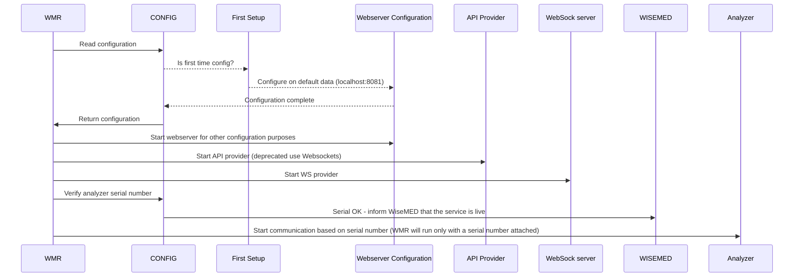

# WiseMED Reader Docs

## About

WiseMED reader (WMR) is a framework aimed to create "_state of the art_" laboratory readers and interface them via API with different LIS systems.

WMR consists of the following modules:

> **Webserver Configuration** - used to configure the initial state of the reader and provide endpoints for its servers (API and Websockets) as long as endpoints to connect to the LIS
 
> **API Provider for LIS** - using this api a LIS will be able to interact with the WMR (read data, scheduling patients, etc.)

> **Websockets Server** - all the clients that are connected to this server are informed in real-time about the communication events that happen between the WMR and the actual laboratory analyzer  

> **Analyzers Communication Layer** - this is the layer that actually communicates with an analyzer. The communication might be either `serial RS232` or `TCP/IP` 

The underlying data is managed by a **SqlLITE database**. To start over simply backup and delete `config.db` file used to keep the WMR's configuration.


## Initialization



WMR will try to read the configuration and if it is not existing (new run) a new default configuration will be created.

If it is a first run, based on the default configuration, a user might connect without username/password and set up the WMR. Here a user has to enter:

> **WiseMED API configuration**   
    IP (`127.0.0.1`)<br>
    Port (`80`)<br>
    Path (`/medicalpages-api/apiv2`)<br>
    Key (`get it from LIS administrator`)


<h1>Implementation of a new analyzer</h1>

```console
read "Analizer name:" analizer_name

echo "This folder will keep the sources of the implementation"
mkdir ./implementation/$analizer_name

echo "This folder will keep the compiled application"
mkdir ./output/$analizer_name

echo "This folder will keep the docs of the analyzer (how to confgure, how to operate...)"
mkdir ./output/$analizer_name/docs
```